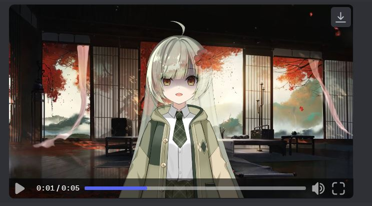

## ISEEKAIGO AI Vtuber & Assistant

Utilizes various technologies such as VoiceVox Engine, DeepL, Whisper OpenAI, Seliro TTS and VtubeStudio to create an AI waifu virtual YouTuber.



## Demo

- [Demo](https://www.youtube.com/shorts/_mKVr3ZaM9Q)
- [Live Test](https://youtu.be/h6UEgJxH1-E?t=1616)
- [Code Explain](https://youtu.be/qpNG9qrcmrQ)
- [Clip](https://www.youtube.com/watch?v=qTkESIBd5Qk)

## Technologies Used

- [VoiceVox Docker](https://hub.docker.com/r/voicevox/voicevox_engine) or [](https://colab.research.google.com/github/SociallyIneptWeeb/LanguageLeapAI/blob/main/src/run_voicevox_colab.ipynb)
- [DeepL](https://www.deepl.com/fr/account/summary)
- [Deeplx](https://github.com/OwO-Network/DeepLX)
- [Whisper OpenAI](https://platform.openai.com/account/api-keys)
- [Seliro TTS](https://github.com/snakers4/silero-models#text-to-speech)
- [VB-Cable](https://vb-audio.com/Cable/)
- VtubeStudio

## Installation

1. Install the dependencies

```
pip install -r requirements.txt
```

2. Create config.py and store your Openai API key

```
api_key = 'yourapikey'
```

And create `.env` file and store your OpenAI api key

```
OPENAI_API_KEY=yourapikey
```

3. Change the owner name

```
owner_name = "YOUR_NAME"
```

if you want to use it for livestream, create a list of users that you want to blacklist on `run.py`

```
blacklist = ["Nightbot", "streamelements"]
```

4. Change the lore or identity of your assistant. Change the txt file at `characterConfig\Character\identity.txt`

5. If you want to stream on Twitch you need to change the config file at `utils/twitch_config.py`. Get your token from [Here](https://twitchapps.com/tmi/). Your token should look something like oauth:43rip6j6fgio8n5xly1oum1lph8ikl1 (fake for this tutorial). After you change the config file, you can start the program using Mode - 3

```
server = 'irc.chat.twitch.tv'
port = 6667
nickname = 'testing' # You don't need to change this
token = 'oauth:43rip6j6fgio8n5xly1oum1lph8ikl1' # get it from https://twitchapps.com/tmi/.
user = 'ardha27' # Your Twitch username
channel = '#aikohound' # The channel you want to retrieve messages from
```

6. Choose which TTS you want to use: `VoiceVox`

```
# Choose between the available TTS engines
# Japanese TTS
voicevox_tts(tts)
```

If you want to use VoiceVox, you need to run VoiceVox Engine first. You can run them on local using [VoiceVox Docker](https://hub.docker.com/r/voicevox/voicevox_engine) or on Google Colab using [VoiceVox Colab](https://github.com/SociallyIneptWeeb/LanguageLeapAI/blob/main/src/run_voicevox_colab.ipynb). If you use the Colab one, change `voicevox_url` on `utils\TTS.py` using the link you get from Colab.

```
//CPU
docker pull voicevox/voicevox_engine:cpu-ubuntu20.04-latest
docker run --rm -it -p '127.0.0.1:50021:50021' voicevox/voicevox_engine:cpu-ubuntu20.04-latest
winpty docker run --rm -it -p '127.0.0.1:50021:50021' voicevox/voicevox_engine:cpu-ubuntu20.04-latest

//GPU
docker pull voicevox/voicevox_engine:nvidia-ubuntu20.04-latest
docker run --rm --gpus all -p '127.0.0.1:50021:50021' voicevox/voicevox_engine:nvidia-ubuntu20.04-latest
winpty run --rm --gpus all -p '127.0.0.1:50021:50021' voicevox/voicevox_engine:nvidia-ubuntu20.04-latest

voicevox_url = 'http://localhost:50021'
```

if you want to see the voice list of VoiceVox you can check this [VoiceVox](https://voicevox.hiroshiba.jp) and see the speaker id on `speaker.json` then change it on `utils/TTS.py`.

7. Choose which translator you want to use depends on your use case (optional if you need translation for the answers). Choose between google translate or deeplx. You need to convert the answer to Japanese if you want to use `VoiceVox`, because VoiceVox only accepts input in Japanese. The language answer from OpenAI will depens on your assistant lore language `characterConfig\Character\identity.txt` and the input language

```
tts = translate_deeplx(text, f"{detect}", "JA")
tts = translate_google(text, f"{detect}", "JA")
```

`DeepLx` is free version of `DeepL` (No API Key Required). You can run [Deeplx](https://github.com/OwO-Network/DeepLX) on docker, or if you want to use the normal version of deepl, you can make the function on `utils\translate.py`. I use `DeepLx` because i can't register on `DeepL` from my country. The translate result from `DeepL` is more accurate and casual than Google Translate. But if you want the simple way, just use Google Translate.

8. If you want to use the audio output from the program as an input for your `Vtubestudio`. You will need to capture your desktop audio using `Virtual Cable` and use it as input on VtubeStudio microphone.

   - Install https://vb-audio.com/Cable/
   - Restart after installation
   - When running the main.py select Cable in 16 inch input
   - After that you can see that cable output is mirroring it, then select that microphone input on Vtubestudio
   - Make sure to change the animation of mouth open into VoiceVolume so it will sync with the audio
   - Make sure expression and keybinding is synced with the main.py code

9. If you planning to use this program for live streaming Use `chat.txt` and `output.txt` as an input on OBS Text for Realtime Caption/Subtitles

## FAQ

1. Error Transcribing Audio

```
def transcribe_audio(file):
    global chat_now
    try:
        audio_file= open(file, "rb")
        # Translating the audio to English
        # transcript = openai.Audio.translate("whisper-1", audio_file)
        # Transcribe the audio to detected language
        transcript = openai.Audio.transcribe("whisper-1", audio_file)
        chat_now = transcript.text
        print ("Question: " + chat_now)
    except:
        print("Error transcribing audio")
        return

    result = owner_name + " said " + chat_now
    conversation.append({'role': 'user', 'content': result})
    openai_answer()
```

Change this Line of Code to this. This will help you to get more information about the error

```
def transcribe_audio(file):
    global chat_now
    audio_file= open(file, "rb")
    # Translating the audio to English
    # transcript = openai.Audio.translate("whisper-1", audio_file)
    # Transcribe the audio to detected language
    transcript = openai.Audio.transcribe("whisper-1", audio_file)
    chat_now = transcript.text
    print ("Question: " + chat_now)


    result = owner_name + " said " + chat_now
    conversation.append({'role': 'user', 'content': result})
    openai_answer()
```

Another option to solve this problem, you can upgrade the OpenAI library to the latest version. Make sure the program capture your voice/sentence, try to hear the `input.wav`

2. Mecab Error

this library is a little bit tricky to install. If you facing this problem, you can just delete and don't use the `katakana_converter` on `utils/TTS.py`. That function is optional, you can run the program without it. Delete this two line on `utils/TTS.py`

```
from utils.katakana import *
katakana_text = katakana_converter(tts)
```

and just pass the `tts` to next line of the code

```
params_encoded = urllib.parse.urlencode({'text': tts, 'speaker': 46})
```

## Credits

This project is inspired by the work of ardhach. Special thanks to the creators of the technologies used in this project including VoiceVox Engine, DeepL, Whisper OpenAI, and VtubeStudio.
